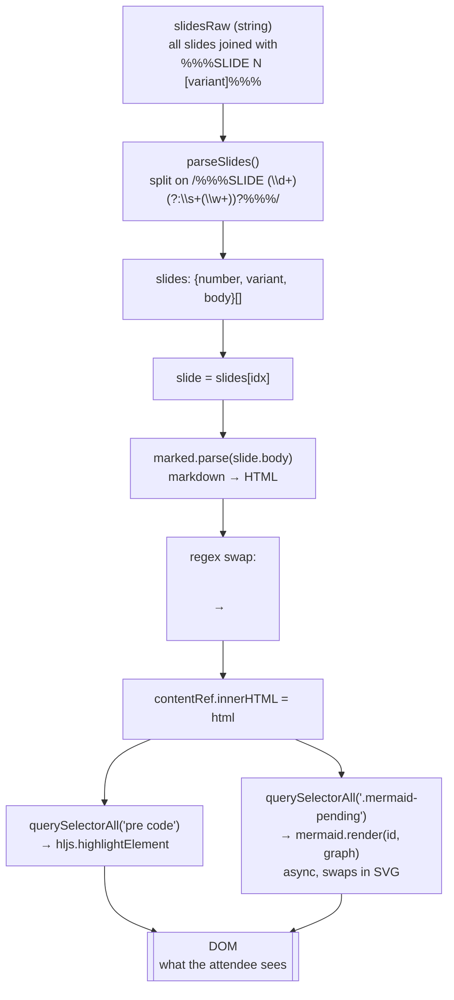

# Slide data pipeline

From the raw string in `slides-data.js` to the DOM the attendee sees.

Gotchas baked into the pipeline:

1. **Raw string fragility.** Every `"` in a slide must be `\"` because the
   whole file is one JS string literal. A stray quote breaks the parser and
   the app shows a blank page. The Stop hook runs `node --check` to catch
   this.
2. **Mermaid code blocks get intercepted** before marked/hljs see them — the
   regex in the render effect converts them to `.mermaid-pending` divs that
   mermaid then hydrates async.
3. **Decoding HTML entities.** When marked wraps code content it escapes
   `<`, `>`, `&`, `"`, `'`. The mermaid interceptor has to un-escape them
   before passing to `mermaid.render`, otherwise the diagram source becomes
   literal `&lt;` text.
4. **Async render ordering.** Mermaid rendering is fire-and-forget per
   diagram; if a user flips slides fast, an older mermaid.render can resolve
   into a DOM node that's already been replaced. Currently tolerated — the
   stale write targets a detached element.
