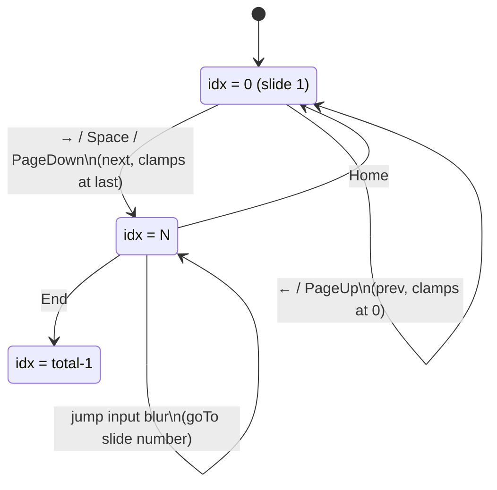

# Slide navigation state machine

The viewer has exactly one piece of state: the current slide index `idx` in
`App.jsx`. All navigation is pure index arithmetic clamped to `[0, total-1]`.

Notes:
- Jump input uses `slide.number`, not `idx`. `number` is the literal slide
  marker (1-based, human); `idx` is the array position (0-based). They usually
  align but `goTo` resolves by number for safety.
- Keyboard handler short-circuits when focus is on an `<input>`, so typing in
  the jump box doesn't trigger navigation.
